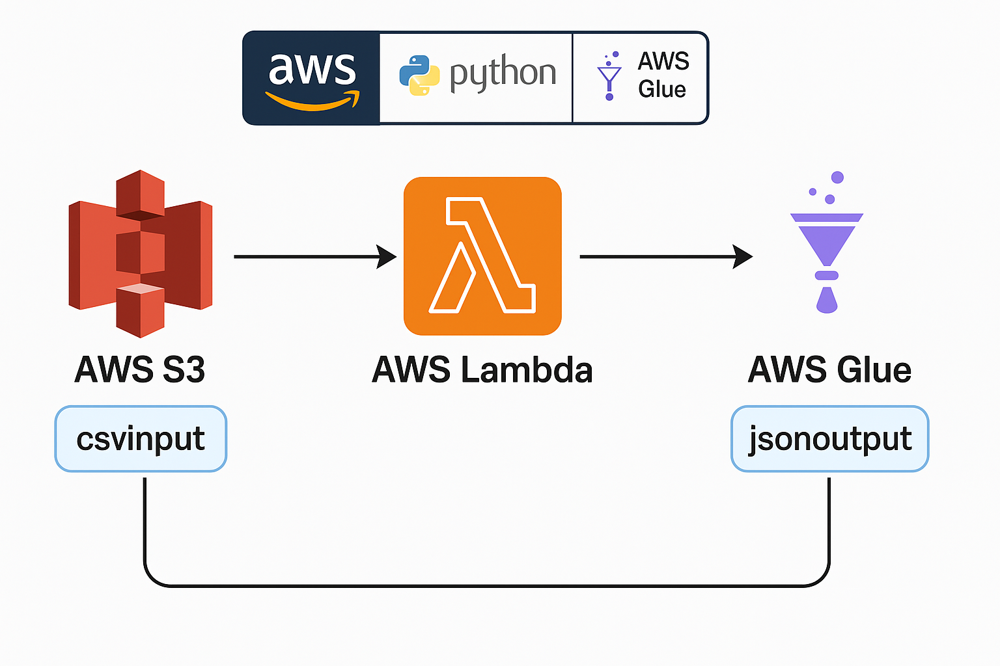

# 🧪 AWS Serverless CSV to JSON ETL Pipeline

This project demonstrates a fully automated serverless data pipeline on AWS that:
- Takes CSV files uploaded to an S3 bucket
- Triggers an AWS Glue Job via AWS Lambda
- Converts the data to JSON format
- Stores the output in another S3 bucket

---

## 🚀 Tech Stack
- **AWS S3** – Source and target storage
- **AWS Glue** – Visual ETL job to convert CSV to JSON
- **AWS Lambda** – Trigger Glue job on S3 file upload
- **AWS CloudWatch** – Logging and monitoring

---

## 🗺️ Architecture Diagram

Here is the high-level architecture of the pipeline:

